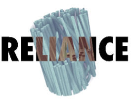

# FibreTracker
 

A python library to track fibre in a volume

## 💻 Getting Started

Create a new environment (highly recommended)

```
conda create -n fibretracker python=3.11
```

Activate the environment by running

```
conda activate fibretracker
```

To read .txm file, install `dxchange` using `conda` [install before fibretracker module to avoid version conflicts and related error]

```
conda install -c conda-forge dxchange
```

Install the FibreTracker tool using `pip`

```
pip install fibretracker
```


Go to Example and run the notebook with `fibretracker` enviroment

## Data

Following are the dataset on which fibre tracking is tested on 250 slices

* Mock and UD [[link](https://zenodo.org/records/5483719)] -    `UD-01_FoV_2_B2_recon.txm`
                                                                `Mock-01_FoV_2_B2_recon.txm`
* GFRP [[link](https://zenodo.org/records/4771123)] - `GFRP_Initial.zip`
* XCT Low-Res [[link](https://zenodo.org/records/1195879)] - `XCT_L.zip`

## License

`fibretracker` was created by Kumari Pooja. It is licensed under the terms
of the MIT license.

## Credits

This work is supported by the [RELIANCE](https://www.chalmers.se/en/projects/reliance/) doctoral network via the Marie Skłodowska-Curie Actions HORIZON-MSCA-2021-DN- 01. Project no: 101073040 

 

<p><small>Project based on the <a target="_blank" href="https://drivendata.github.io/cookiecutter-data-science/">cookiecutter data science project template</a>. #cookiecutterdatascience</small></p>
